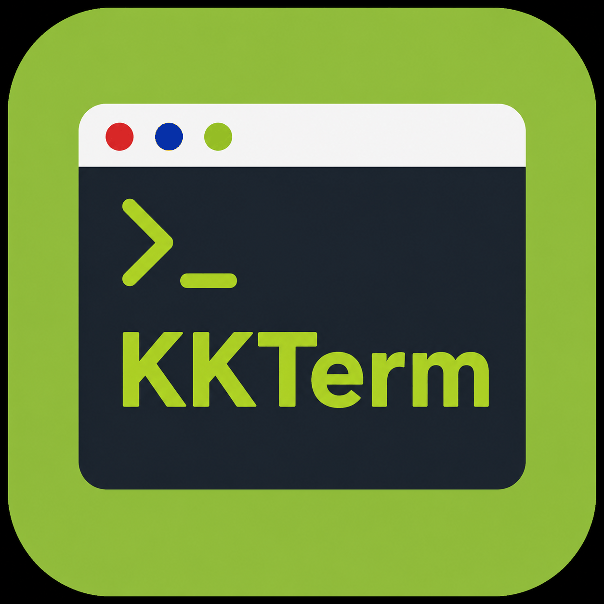
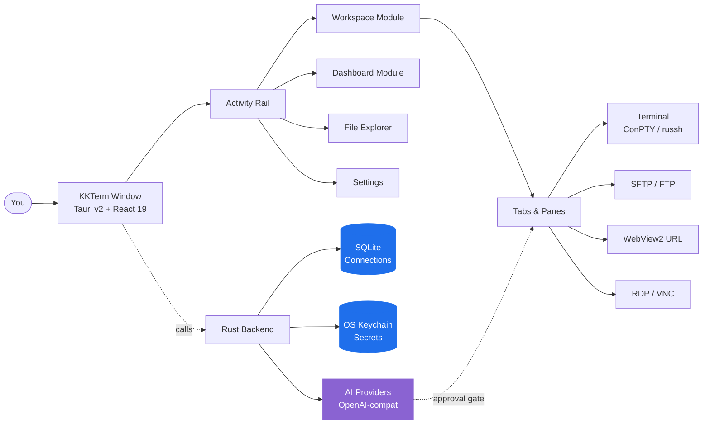

<p align="center">
  
</p>

<h1 align="center">KKTerm</h1>

<p align="center">
  <strong>One Windows app for terminals, SSH, SFTP, RDP/VNC, dashboards, and an AI that asks before it touches anything.</strong>
</p>

<p align="center">
  <em>Because your taskbar shouldn't look like a Vegas slot machine.</em>
</p>

<p align="center">
  <a href="https://github.com/ryantsai/KKTerm/stargazers">
    
  </a>
  <a href="https://github.com/ryantsai/KKTerm/network/members">
    
  </a>
  <a href="https://github.com/ryantsai/KKTerm/issues">
    
  </a>
  <a href="https://github.com/ryantsai/KKTerm/blob/main/LICENSE">
    
  </a>
  <br />
  
  
  
  
  
  <br />
  <sub><a href="README.zh-TW.md">繁體中文</a></sub>
</p>

---

## The Pitch (45 seconds)

You're a sysadmin / DevOps / homelab person. Right now you have:

- A terminal emulator
- A separate SSH client (with a profile list it took you a weekend to build)
- An SFTP client from 2007 that somehow still ships
- Remote Desktop in a window you keep losing on the wrong monitor
- A VNC viewer for that one Linux box
- A browser tab for the router admin UI
- A sticky note with passwords *(don't worry, we won't tell)*

**KKTerm is one window for all of that.** Native on Windows, written in Rust + Tauri v2, ships as a single installer, and refuses to phone home.

Oh, and there's an AI assistant. But it has to ask permission before it does anything that could end your career.

> ⭐ **If this sounds like the app you've been meaning to build for the last six years — star the repo so we know someone's watching. It genuinely helps.**

---

## Why People Keep It Open All Day

### Local-first means actually local

Your saved **Connections** live in a SQLite file on your machine. Passwords live in the **Windows Credential Manager**, not in a JSON next to the binary. The app does not ship analytics, does not call home on startup, and does not need a cloud account to launch. There is no "sign in to sync" because there is no sync.

If your network cable catches fire, KKTerm still opens.

### One workspace, every connection type

| You wanted to… | KKTerm has |
| --- | --- |
| Open a local PowerShell / cmd / WSL shell | ConPTY-backed local terminal **Sessions** |
| SSH into a server | Native `russh` with agent / key / password auth, host-key trust flow, ProxyJump, port forwarding |
| Browse files on that server | SFTP launched from the SSH **Connection**, dual-pane, recursive transfers, chmod/chown |
| FTP to a NAS from 2012 | FTP / FTPS **Connections** in the same SFTP-style browser |
| Telnet to ancient gear | Yes, fine, Telnet is in there too |
| Talk to a serial port | Serial **Connection** kind, COM port + baud, no extra tooling |
| Remote into a Windows box | Native RDP via the Microsoft ActiveX control (the real one, not a clone) |
| VNC into a Pi | Rust `vnc-rs` framebuffer rendered straight into the workspace |
| Open the router's web UI | Embedded WebView2 **URL Connection** with credential fill |
| Watch CPU on the host | Live status bar + a **Dashboard** module with drag/resize widgets |

It's all the same app. Same window. Same hotkeys. Same hopefully-not-eye-bleeding theme.

### Terminals that don't lose their minds

- Split panes inside a **Tab**.
- WebGL-accelerated xterm.js rendering, falling back gracefully when it can't.
- Scrollback search.
- tmux-backed SSH panes that can attach to stable per-pane sessions, so reconnecting actually means *reconnecting*, not "starting over and pretending the last hour didn't happen."
- Switching **Tabs** does **not** kill the **Session**. Closing the **Tab** does. This distinction was a religious war internally; we won.

### An AI Assistant that respects the airlock

Most "AI in your terminal" demos look great in a video and terrifying in production. KKTerm's assistant is built around two switches:

- **Tool families** (Dashboard / Connections / Live Sessions) — toggle them on or off per category.
- **Permission mode** in the composer — `Prompt` (default, asks every time) or `Allow All` (you're an adult, you signed the waiver).

Talk to OpenAI, Anthropic, OpenRouter, DeepSeek, Grok, Azure OpenAI, LiteLLM, GitHub Copilot, Ollama, NVIDIA, or anything OpenAI-compatible. API keys go to the OS keychain. Models that propose `rm -rf` get classified as dangerous and require explicit human approval. The AI cannot quietly run a destructive command because somebody got clever with a prompt injection in a man page.

### A Dashboard that doesn't pretend to be Grafana

The **Dashboard** module is a 12-column drag/resize grid of widget instances. It's not for petabyte observability — it's for "I want a button to launch my five favorite apps and a panel showing my SSH host's uptime, *next to* my chat."

The AI can author widgets on request: declarative content widgets (markdown / kv list / checklist / stat) or script widgets sandboxed in an isolated `iframe srcdoc`. You don't write the JS; you describe what you want.

---

## How It Fits Together



The shape that matters: durable saved data (**Connection**) is separate from live runtime state (**Session**), which is separate from the UI container (**Tab**). Closing a **Tab** ends the **Session**. Switching **Tabs** does not. This is the rule that keeps the app sane.

---

## Current Feature Map

| Area | Implemented today |
| --- | --- |
| **Connections** | SQLite-backed tree, folders/subfolders, search, drag/drop order, rename, duplicate, delete, **Quick Connect**, custom icons, pinned/active rail shortcuts |
| **Terminal** | Local shells, SSH, Telnet, Serial, split panes, xterm.js + opportunistic WebGL, scrollback search, local startup directory/script |
| **SSH** | Native `russh`, agent/key/password auth, host-key trust flow, optional system SSH fallback, ProxyJump, port forwarding, tmux attach/list/rename/close/mouse controls |
| **SFTP / FTP** | SSH-launched SFTP plus FTP/FTPS **Connections**, dual-pane browser, recursive transfers, queue/cancel/clear history, conflicts, properties, chmod/chown where supported |
| **URL WebView** | Embedded WebView2 URL **Sessions**, navigation toolbar, favicon capture, stored website credential metadata/fill, data partition metadata |
| **Remote Desktop** | RDP through Windows ActiveX with geometry-scoped overlay parking; VNC through `vnc-rs` framebuffer rendered in the workspace canvas |
| **Dashboard** | Durable views, widget instances, edit mode, drag/resize, App Launcher, AI Created content/script widgets, per-widget presets / accent / icon / title / settings |
| **AI Assistant** | Streaming chat, OpenAI-compatible runtime, provider registry, command proposal safety classification, screenshot/context attachments, Dashboard tool calls, **Connection** management tools, and live **Session** tools for terminal, RDP/VNC, and SFTP/FTP |
| **Settings** | General, Appearance, Credentials, AI, SSH, Terminal, URL, RDP, VNC, Dashboard, About; custom UI fonts; minimize-to-tray; Don't Sleep; backup/import |
| **Localization** | i18next UI with English source and dynamic locale bundles: zh-TW, zh-CN, ja, ko, fr, de, es, es-MX, it, pt-BR, th, id, vi |

### AI Providers

OpenAI · Anthropic · OpenRouter · DeepSeek · Grok · Azure OpenAI · LiteLLM · GitHub Copilot · Ollama · NVIDIA · any OpenAI-compatible endpoint.

Provider metadata lives in [`src/ai/providerRegistry/`](src/ai/providerRegistry/); Rust adapters in [`src-tauri/src/ai/providers/`](src-tauri/src/ai/providers/). API keys go through the OS keychain, never SQLite.

---

## Quick Start

You need:

- **Windows** (primary supported platform)
- **Node.js + npm**
- **Rust toolchain**
- **Tauri v2 prerequisites for Windows** including **WebView2**

```bash
npm install
npm run tauri dev
```

That should produce a real native window. If it produces a stack trace instead, please file an issue — we love a good repro.

### Common checks

```bash
npm run check                                              # TypeScript
npm run build                                              # Vite build
cargo check --manifest-path src-tauri/Cargo.toml           # Rust
cargo test  --manifest-path src-tauri/Cargo.toml           # Rust tests
```

### Build the Windows installer

```bash
npm run package:installer
```

The installer script writes `artifacts/kkterm-<version>-windows-x64-setup.exe` and a matching `.sha256` file. It is currently **unsigned** — release signing is on the roadmap, but until then your antivirus may give you a stern look. That's normal.

---

## What KKTerm Is Not

A short list, because honesty earns trust:

- **Not a cloud product.** No sync, no team accounts, no SaaS tier. If you ever see a "Sign in to KKTerm" dialog, something has gone catastrophically wrong.
- **Not cross-platform yet.** macOS and Linux are on the roadmap. Today, Windows is the only platform we test against.
- **Not an autonomous AI agent.** The assistant proposes; the human disposes. `Allow All` is a choice you make, not a default.
- **Not a Grafana / Datadog replacement.** The Dashboard is for personal control surfaces, not 10k-host observability.
- **Not a Kubernetes IDE.** It is a terminal-first admin workspace. Please don't ask it to render a Helm chart.

If any of those *was* a dealbreaker — fair enough, we'll see you in v2.

---

## Native Debugging

Use the real Tauri runtime for validation:

```bash
npm run tauri dev
```

A Vite browser preview is useful for some frontend inspection, but it does **not** host a real WebView2, ConPTY, RDP ActiveX, VNC framebuffer, keychain, or native menu surface. If a feature touches any of those, validate it in the actual desktop runtime.

VS Code users: the `Run KKTerm exe` launch config starts `src-tauri/target/debug/kkterm.exe` with `RUST_BACKTRACE=1`. The paired `Attach KKTerm WebView2` config gives you DevTools inside the real WebView2 host.

---

## Current Limits (yes, we know)

- Windows is the primary supported platform; macOS / Linux packaging is planned.
- The installer is currently unsigned. Update checks are disabled until release signing is configured.
- SFTP over ProxyJump is not yet supported in the native SFTP path.
- File transfer resume, folder sync/diff, archive/extract, and remote editing are deferred.
- SSH config import is implemented but the user-facing entry in Settings is not yet exposed.
- RDP and VNC are shipping; richer clipboard/device sync and quality controls are still evolving.
- The AI assistant proposes and can operate enabled tools within the configured permission boundary — please do not treat it as an unattended robot. It does not, in fact, know what your CEO wants.

---

## Roadmap (the short version)

- macOS + Linux builds
- Signed installer + auto-update
- SFTP over ProxyJump in the native path
- File transfer resume, folder sync, archive/extract
- Richer RDP clipboard/device redirection
- More built-in **Dashboard** widgets (and a public schema for AI-authored ones)

Full and frequently-updated version: [`docs/ROADMAP.md`](docs/ROADMAP.md).

---

## Contributing

We would love a hand. Genuinely. Even small things matter:

- **Try the dev build** and file an issue when something feels off. "It felt off" is a legitimate bug report; we'll dig with you.
- **Translate a locale.** English is the source of truth at [`src/i18n/locales/en.json`](src/i18n/locales/en.json); 12 other locales live next to it and load on demand. Pending strings are tracked per-key under [`docs/localization_todo/`](docs/localization_todo/) — pick one, translate it, delete the file.
- **Add a Dashboard widget.** Built-in widgets live in [`src/dashboard/widgets/`](src/dashboard/widgets/). Pick a small idea, ship it, learn the pattern.
- **Tighten the AI tool surface.** Provider adapters live in [`src-tauri/src/ai/providers/`](src-tauri/src/ai/providers/); the frontend registry is in [`src/ai/providerRegistry/`](src/ai/providerRegistry/).
- **Improve the manual.** End-user docs live in [`docs/manual/`](docs/manual/). One chapter per UI module. If you used a feature and the docs didn't help, a PR fixing that is gold.

A few ground rules — they're in [`AGENTS.md`](AGENTS.md), but the highlights:

- **Read [`CONTEXT.md`](CONTEXT.md) before renaming user-facing terms.** **Connection**, **Session**, **Tab**, and **Quick Connect** mean specific things; please don't drift.
- **Every user-visible string goes through `t()`.** No bare English text in JSX.
- **No frontend close hooks.** Tauri v2's title-bar close has been broken by `onCloseRequested` patterns a half-dozen times. We finally have a working shape; please don't reintroduce them.
- **Run the checks** (`npm run check && npm run build && cargo check && cargo test`) before opening a PR.

Looking for an entry point? Filter open issues by [`good first issue`](https://github.com/ryantsai/KKTerm/issues?q=is%3Aissue+is%3Aopen+label%3A%22good+first+issue%22) or [`help wanted`](https://github.com/ryantsai/KKTerm/issues?q=is%3Aissue+is%3Aopen+label%3A%22help+wanted%22). If there aren't any tagged yet, open an issue describing what you'd like to work on and we'll help scope it.

---

## Project Docs

- [Product context](CONTEXT.md) — the domain language you should match
- [Architecture](docs/ARCHITECTURE.md) — module map, where to put new code
- [Roadmap](docs/ROADMAP.md)
- [Dashboard architecture](docs/DASHBOARD.md)
- [AI provider guide](docs/AI_PROVIDERS.md)
- [Performance notes](docs/PERFORMANCE.md)
- [Release notes and gates](docs/RELEASE.md)

---

## Stack

Rust · Tauri v2 · React 19 · TypeScript · Vite · Tailwind CSS · Zustand · xterm.js · SQLite · WebView2 · `russh` · `russh-sftp` · `vnc-rs` · `suppaftp` · OS keychain storage.

---

## Star History

<a href="https://www.star-history.com/#ryantsai/KKTerm&Date">
  <picture>
    <source media="(prefers-color-scheme: dark)" srcset="https://api.star-history.com/svg?repos=ryantsai/KKTerm&type=Date&theme=dark" />
    <source media="(prefers-color-scheme: light)" srcset="https://api.star-history.com/svg?repos=ryantsai/KKTerm&type=Date" />
    
  </picture>
</a>

If you got this far and you haven't starred it yet — what are you waiting for, a personal invitation? Consider this the personal invitation.

⭐ **[Star KKTerm on GitHub](https://github.com/ryantsai/KKTerm)** — it costs one click and makes the maintainer's whole week.

---

## License

MIT. See [LICENSE](LICENSE). Use it, fork it, ship it, put it in a homelab nobody else can find — that's the deal.
